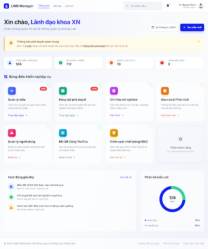
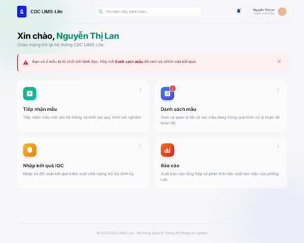

## Context

This change adds prominent alert banners to both manager and analyst dashboards. The current manager notification is plain text that's easy to overlook. The analyst has no rejection notification at all.

## Visual Design

### Manager Dashboard — Amber Alert Banner

Replaces the plain-text "Bạn có X mẫu đang chờ phê duyệt" with a prominent amber banner below the welcome section.

**Design notes:**
- Amber/warning color scheme with `AlertTriangle` icon
- Left border accent for visual weight
- Clickable link to `/manager/approvals`
- No dismiss button — disappears when count reaches 0

---

### Analyst Dashboard — Red Alert Banner + Badge

Adds a red/rose alert banner and badge count on the "Danh sách mẫu" card.

**Design notes:**
- Red/rose error color scheme — more urgent than manager's amber
- Same layout pattern as manager banner (shared `DashboardAlertBanner` component)
- Red badge on "Danh sách mẫu" card mirrors the existing approval badge pattern
- Only visible to the analyst who accessioned the rejected sample
- No dismiss button — disappears when rejected count reaches 0

## Shared Component: `DashboardAlertBanner`

Both banners use a single reusable component with two variants:

| Prop | Warning (Manager) | Error (Analyst) |
|------|-------------------|-----------------|
| `variant` | `warning` | `error` |
| Background | Amber/orange | Red/rose |
| Icon | AlertTriangle | AlertTriangle |
| Link target | `/manager/approvals` | `/samples` |
| Trigger | `status = 'review'` count > 0 | Rejected samples count > 0 |

## Decisions

- **Shared component over role-specific**: One `DashboardAlertBanner` with variant prop, reducing code duplication
- **No dismiss**: Persistent visibility ensures issues are addressed, not hidden
- **Query-based count**: No new notification table — reuses existing `samples` fields

## Stitch Project Reference

- **Project**: [CDC LIMS - Dashboard Notification Mockups](https://stitch.withgoogle.com/projects/13184980411857661574)
- **Screen 1**: LIMS Manager Dashboard (`b466b4abc86b4d12b901687276935e52`)
- **Screen 2**: LIMS Analyst Dashboard (`c5cfda096bb04816806ba801891ed040`)
